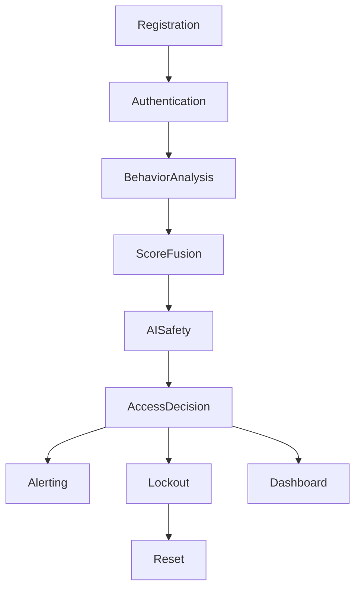

# Authentication Pipeline Architecture

This document details the step-by-step authentication pipeline for the Smart Lock Security System, from user registration to access decision, including anomaly handling and alerting.

## Step-by-Step Pipeline

### 1. Registration
- User enrolls face and voice samples.
- PIN is set and hashed (SHA-225).
- Data stored in respective databases/files.

### 2. Authentication Attempt
- User presents face and voice.
- Enters PIN.
- System captures live face and voice, verifies against stored embeddings.
- PIN is hashed and compared.

### 3. Behavior Analysis
- System checks user behavior (timing, frequency, location, etc.).
- Decision trees and anomaly detectors score the attempt.

### 4. Score Fusion
- Scores from face, voice, PIN, and behavior are combined.
- Thresholds and weights determine access/denial.

### 5. AI Safety & GenAI Analysis
- GenAI analyzes anomalies and provides recommendations.
- AI safety module checks for unusual patterns.

### 6. Access Decision
- If scores are normal, access is granted.
- If anomaly detected, system increases scrutiny (multi-step checks).
- If high anomaly or repeated failures, access is denied and lockout is triggered.

### 7. Alerting
- Alerts sent via email, SMS, Telegram bot.
- Captured images and voice samples attached.

### 8. Lockout & Reset
- Lockout system restricts access after repeated failures.
- Vacation mode disables biometric entry.
- Reset modules allow admin recovery.

### 9. Dashboard & Monitoring
- All events, scores, and alerts are logged.
- Dashboard displays real-time status and analytics.

---

## Authentication Flow Diagram

---

