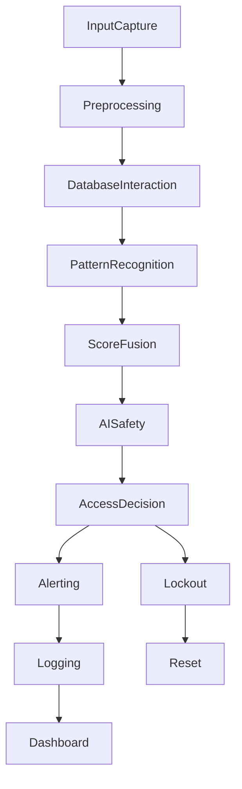

# Data Flow Pipeline Architecture

This document describes the data flow pipeline of the Smart Lock Security System, from input capture to final access decision and alerting.

## Data Flow Steps

### 1. Input Capture
- Face image and voice sample captured live.
- PIN entered by user.

### 2. Preprocessing
- Face and voice samples processed into embeddings.
- PIN hashed (SHA-225).

### 3. Database Interaction
- Embeddings and PIN hashes retrieved from database/files.
- Behavior logs accessed for scoring.

### 4. Pattern Recognition & Scoring
- Face and voice verified against stored embeddings.
- PIN compared to stored hash.
- Behavior scored using decision trees/anomaly models.
### 5. Score Fusion
- All scores combined for final decision.

### 6. AI Safety & GenAI Analysis
- Data sent to GenAI for anomaly analysis.
- AI safety module reviews and recommends actions.

### 7. Access Decision
- Grant or deny access based on fused scores and analysis.

### 8. Alerting & Logging
- Alerts sent (email, SMS, Telegram) with captured data.
- Events logged for dashboard and analytics.

### 9. Lockout & Reset
- Lockout triggered on repeated anomalies.
- Reset modules invoked as needed.

### 10. Dashboard & Monitoring
- Data visualized in dashboard.
- Admins monitor system status and logs.

---

## Data Flow Diagram

---

