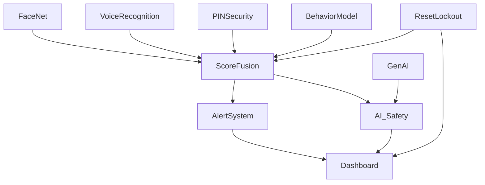
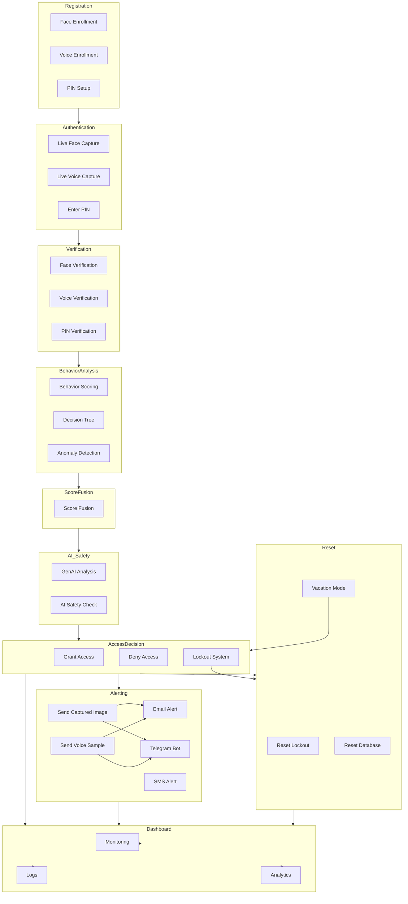

# Module-wise Architecture Overview

This document describes the module-wise architecture of the Smart Lock Security System, detailing each module's purpose and how they interconnect to deliver robust, multi-factor authentication and anomaly detection.

## Modules and Their Roles

### 1. Face Recognition (FaceNet)
- **Purpose:** Captures and verifies live facial images using embeddings.
- **Files:** FaceNet/capture_live.py, FaceNet/verify_face.py, FaceNet/enroll_faces.py
- **Connection:** Integrates with the authentication pipeline, stores embeddings, triggers alerts on anomaly.

### 2. Voice Recognition
- **Purpose:** Enrolls and verifies user voice samples for authentication.
- **Files:** VoiceRecognition/enroll_my_voice.py, VoiceRecognition/smart_lock.py
- **Connection:** Works alongside face recognition for multi-factor authentication.

### 3. PIN Security
- **Purpose:** Manages PINs, hashes them using SHA-225, and verifies input.
- **Files:** Configuration/pin_security.py, pin.txt, pin_hash.json
- **Connection:** Used as an additional authentication factor; integrates with reset and lockout modules.

### 4. Behavior Model
- **Purpose:** Scores user behavior patterns (timing, frequency, etc.) using decision trees and anomaly detection.
- **Files:** models/behavior_model.py, models/anomaly_detector.py
- **Connection:** Feeds scores into the fusion module for final decision.

### 5. Score Fusion
- **Purpose:** Combines scores from face, voice, PIN, and behavior models to make access decisions.
- **Files:** models/score_fusion.py
- **Connection:** Central decision point; triggers alerts and access/denial.

### 6. AI Safety
- **Purpose:** Provides additional safety checks and analysis using GenAI.
- **Files:** ai_safety.py
- **Connection:** Analyzes anomalies, generates reports, and recommends actions.

### 7. Alert System
- **Purpose:** Sends alerts via email, SMS, and Telegram bot on suspicious activity or lockout.
- **Files:** Alert_system/alert.py, Alert_system/send_email.py, Alert_system/telegram_webhook.py
- **Connection:** Activated by the fusion module or lockout events.

### 8. Reset & Lockout
- **Purpose:** Handles lockout, resets, and vacation mode (biometric lock).
- **Files:** reset_lockout.py, reset_database.py, reset_access_log.py
- **Connection:** Manages access restrictions and recovery.

### 9. Dashboard & Monitoring
- **Purpose:** Provides real-time status, logs, and analytics.
- **Files:** templates/index.html, logs/
- **Connection:** Visualizes system state and user activity.

### 10. GenAI Connection
- **Purpose:** Analyzes data, provides anomaly analysis, and access recommendations.
- **Files:** ai_safety.py, Model/explanation_model.py
- **Connection:** Works with behavior and fusion modules for advanced analysis.

---

## Module Interconnections

- **Authentication Pipeline:** Face, voice, PIN, and behavior scores are fused for access decisions.
- **Alert System:** Triggered by anomalies, lockouts, or failed authentication.
- **Reset & Lockout:** Restricts access during vacation or after repeated failures.
- **Dashboard:** Monitors all modules and displays analytics.
- **GenAI:** Provides deeper analysis and recommendations.

---

## Diagram

---

## Perfect System Flow Diagram

---
